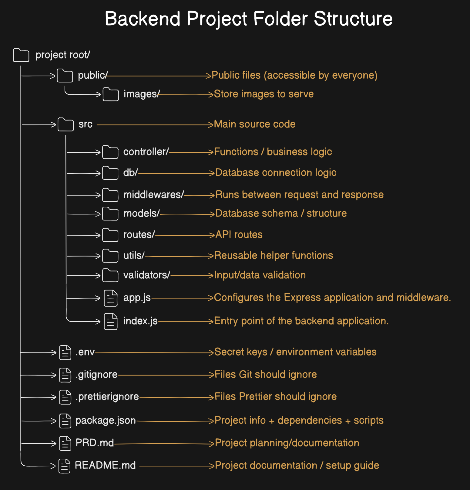

# Backend Foundation

Backend Foundation is my personal backend learning repository where I document and practice core backend development concepts by building real-world projects using Node.js, Express.js, and MongoDB. This repository tracks my journey of learning server-side development, authentication, APIs, database integration, and scalable backend architecture.

## Terminal-Based Project Setup

Follow these terminal commands to set up the initial backend project structure from scratch.

### Step 1: Create the project folder and move into it

```bash
mkdir backend-foundation && \
cd backend-foundation
```

### Step 2: Initialize the Node.js project and generate `package.json`

```bash
npm init
```

### Step 3: Install Prettier as a development dependency

```bash
npm install --save-dev --save-exact prettier
```

### Step 4: Create the complete project folder structure in a single command

```bash
mkdir public src && \
mkdir public/images && \
cd src && \
mkdir controllers models routes middlewares utils db validators && \
touch app.js index.js && \
touch controllers/.gitkeep models/.gitkeep routes/.gitkeep middlewares/.gitkeep utils/.gitkeep db/.gitkeep validators/.gitkeep && \
cd .. && \
touch public/images/.gitkeep .env .gitignore .prettierrc .prettierignore
```

### Step 5: Configure `.gitignore`

```bash
node_modules/
.env
.vscode/
.DS_Store
dist/
```

### Step 6: Configure `.prettierrc`

```bash
{
  "tabWidth": 2,
  "useTabs": false,
  "semi": true,
  "singleQuote": false,
  "trailingComma": "all",
  "bracketSpacing": true,
  "arrowParens": "always"
}
```

### Step 7: Configure `.prettierignore`

```bash
node_modules
dist
.env
package-lock.json
```

## Project Structure



## Installing Required Dependencies

Install dotenv to manage environment variables from a `.env` file.

```bash
npm i dotenv
```

Install nodemon to automatically restart the server when file changes are detected.

```bash
npm i nodemon
```

Installs Express framework for building backend APIs and handling routes.

```bash
npm i express
```

Enables CORS for handling cross-origin requests.

```bash
npm i cors
```

Installs Mongoose for interacting with MongoDB using schemas and models.

```bash
npm i mongoose
```

Installs bcrypt for hashing and securing user passwords.

```bash
npm i bcrypt
```
